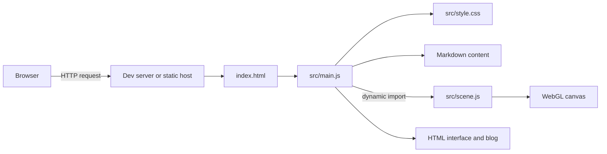

# 1. The browser and the project

[Learning path](../README.md) · Next: [Tools and local development](02-tools-and-local-development.md)

**Goal:** trace a request from your browser to the code that draws the house.

**Read alongside:** [index.html](../../index.html), [main.js](../../src/main.js), and [the component map](../reference/component-map.md).

## Two JavaScript environments

You already know JavaScript, but where it runs changes which APIs exist.

| Environment | Its job here | Example APIs |
| --- | --- | --- |
| Node.js on your computer or a CI runner | Run Vite, install tools through npm, build files, drive browser tests | File access, processes, package loading |
| The visitor’s browser | Display HTML, handle input, play audio, render Three.js | `document`, `window`, `AudioContext`, WebGL |

The browser does not run `npm run dev`. Node does not draw the scene. Playwright runs in Node and controls a separate browser process, which runs the application.

An eventual static host sends files over HTTP. It does not need a persistent Node process to execute this application. A build service may use Node before those files are published.

## What happens when you open the site

1. You request an address such as `http://localhost:5173/`.
2. The development server returns `index.html`.
3. The browser parses the HTML into the **DOM**, a tree of elements.
4. The module script near the end loads `src/main.js`.
5. Its imports bring in CSS, the Markdown parser, and Markdown text transformed by Vite.
6. `main.js` installs event listeners, handles the current URL fragment, and starts importing `scene.js`.
7. `initWorld()` creates a WebGL canvas and appends it to `#world`.
8. A render loop updates the view. DOM events change application state.



The visual world and the blog share the same document. The computer does not load a second website in an iframe.

## The repository, file by file

```text
personal-website/
├── index.html                 Browser entry point and interface markup
├── package.json               Project metadata, scripts, dependency ranges
├── package-lock.json          Exact resolved dependency graph
├── vite.config.js             Build and asset-path configuration
├── .gitignore                 Generated/local files Git should ignore
├── .github/workflows/
│   └── deploy.yml             GitHub Pages build-and-deploy workflow
├── src/
│   ├── main.js                UI state, blog routes, audio, scene wiring
│   ├── scene.js               Geometry, rendering, movement, collisions
│   └── style.css              Arrival, overlays, retro desktop, mobile styles
├── content/                   Trusted Markdown blog entries
├── public/                    Currently empty; future copy-as-is assets
├── docs/                      This course and its examples
├── node_modules/              Installed packages; generated, ignored
└── dist/                      Production output; generated, ignored
```

Empty directories such as `public/` may not exist after a Git clone because Git tracks files, not empty folders. Create one when you have an asset to put in it.

Source files are the material you edit. `dist/` is a generated result: a fresh build may replace it. Fixing a bug directly in `dist/` loses the fix on the next build.

`docs/` is repository learning material. Vite does not automatically turn these Markdown documents into a public documentation website.

## URLs, paths, and fragments

In `http://localhost:5173/#note-reading`:

- `http` is the protocol.
- `localhost` names this machine.
- `5173` is the port where the server listens.
- `/` is the requested path.
- `#note-reading` is a fragment interpreted by our browser code.

The fragment is not sent to the HTTP server. This matters later: article links work on a simple static host because the server only has to deliver the root document.

`localhost` on someone else’s laptop means their laptop, not yours. Starting a local server is not publishing a website. Likewise, an address beginning `file://` bypasses Vite; double-clicking `index.html` cannot supply the package resolution and import transformations this project expects.

## What “component” means here

There are no React components. A component can still be a coherent responsibility: the arrival interface, movement controller, collision list, or blog renderer. Those responsibilities currently live in a few large files. Naming the boundaries now makes it easier to extract modules later.

## Try it

Open DevTools → Network and reload. Inspect the document, JavaScript, CSS, and font requests. Compare their types. Then click a journal entry and observe that the URL fragment changes without a new HTML document request.

**Expected:** the page does not reload when you move between blog entries. The DOM changes inside the existing page.

## Checkpoint

Explain why this application needs Node during development but can run on a static host. Name the three files you would inspect to change the arrival text, the wallpaper colors, and the walking speed.
