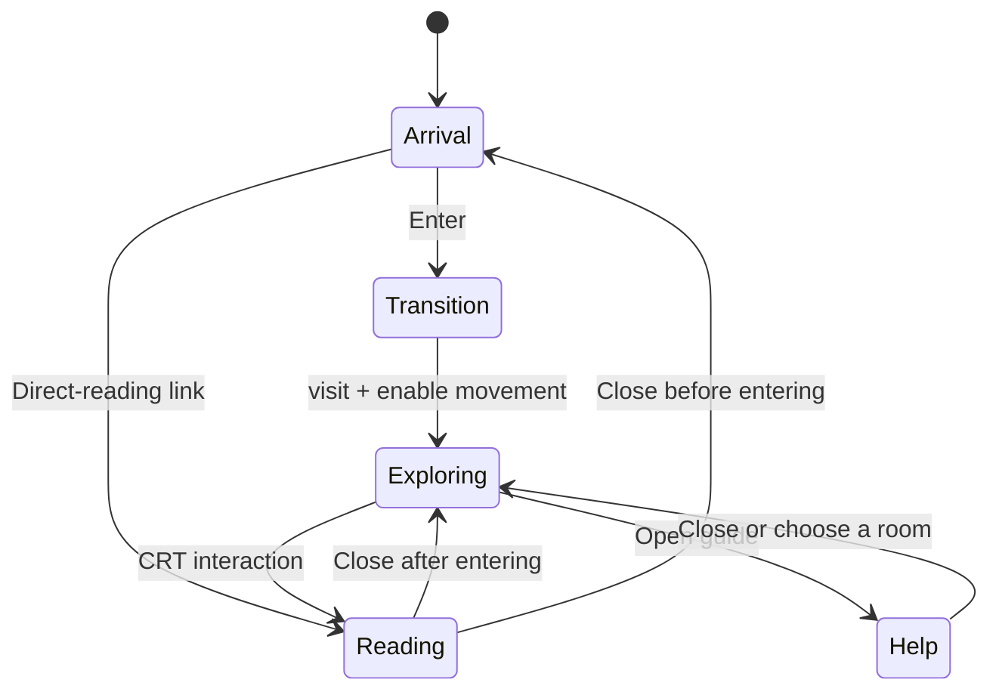

# 4. Application state and navigation

[Previous](03-html-css-and-interface.md) · [Learning path](../README.md) · [Next](05-threejs-fundamentals.md)

**Goal:** trace how a user action crosses the boundary between the DOM and the 3D world.

**Read alongside:** [main.js](../../src/main.js), especially `enter`, `route`, `openDesktop`, `closeDesktop`, and the final dynamic import.

## The application coordinator

`main.js` owns the page experience. It knows about article data, DOM elements, dialogs, and URL fragments. `scene.js` owns the world and reports events through callbacks.

The existing boundary, expanded for readability:

```js
world = initWorld({
  onComputer: () => location.hash = 'journal',
  onLocation: name => $('#location').textContent = name,
  onNearComputer: near => $('#interact').hidden = !near,
  onFailure: unavailable,
});
```

The scene returns two methods: `visit(place)` and `setActive(value)`. The `$` helper is only shorthand for `document.querySelector`; it is not jQuery.

This is a small example of dependency injection: the scene is given functions to call when something happens. It does not need to know how articles are rendered. The boundary is imperfect—`scene.js` still finds the canvas host and mobile buttons directly—but it is a useful starting point.

## State is more than what is visible

`exploring` records that the user has entered the world. `transitioning` prevents overlapping arrival transitions. `world` is initially undefined while its module loads.

The native dialogs have their own `open` state. Inside the scene, `active` means movement input is enabled. It does **not** mean all rendering is stopped.



This diagram is a conceptual model. The current code implements it with flags and dialog checks, not a formal state-machine library. Guide shortcuts can also start exploration from arrival.

## The arrival transition

`enter(place)` checks readiness, sets `transitioning`, shows `#dream`, and awaits a timer. It then hides arrival, shows the HUD, teleports the camera with `world.visit(place)`, and removes the fade.

The timer is 950ms unless reduced motion is requested, in which case it is zero. The fade conceals a position change; there is no animated camera journey through the landscape.

`await` suspends this function while the browser can continue rendering and processing events. It does not freeze JavaScript for almost a second.

A future improvement is to pause world input for the entire transition, and use explicit transition completion rather than relying on a timer aligned with CSS. These are prototype choices worth recognizing.

## URL fragments drive the blog

`route()` reads `location.hash`, searches for an article, then selects a tab or closes the desktop for an unrecognized route.

| Fragment | Result |
| --- | --- |
| `#journal` | Journal index |
| `#work` | Projects |
| `#reading` | Reading page |
| `#about` | Biography |
| `#note-reading` | A specific sample article |
| Empty or unrecognized | Close the desktop |

We call `route()` once on startup for direct links, and again on `hashchange` for later navigation. There is no routing library or server-side route resolver.

Changing a fragment updates browser history. `closeDesktop()` instead calls `history.replaceState` to remove the fragment from the current entry, then explicitly closes the dialog. `replaceState` does not dispatch `hashchange`, so the explicit cleanup is necessary. Back and Forward therefore reflect fragment navigation plus this replacement behavior; closing is not simply “go back once.”

## Load the world separately

`import('./scene.js')` is dynamic and returns a promise. This creates an asynchronous module boundary. Vite can emit separate chunks for it.

The import is invoked immediately at startup, not when Enter is clicked. It separates loading and failure handling; it does not yet avoid downloading Three.js for a visitor who only reads. Optional chaining such as `world?.setActive(false)` lets direct reading work before initialization finishes.

If import or initialization fails, `unavailable()` keeps the writing reachable. The same handler is used if the graphics context is later lost.

## Try it

Load a fresh page at `/#note-reading`. Close the computer. Reload at `/`, enter the house, and open the same article. Close again.

**Expected:** the first close returns to arrival; the second returns to exploration. The same article route can be reached from different previous states.

## Checkpoint

Trace pressing E from `scene.js` through `onComputer`, `hashchange`, `route`, and `openDesktop`. Explain why hiding a dialog without restoring the input state would leave the world unusable.
