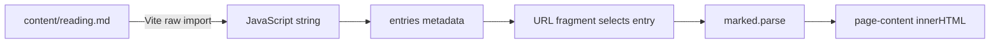

# 8. The computer and the blog

[Previous](07-movement-and-interaction.md) · [Learning path](../README.md) · [Next](09-atmosphere-and-performance.md)

**Goal:** understand the bridge between an object in the world and a readable website.

**Read alongside:** `textPlane()` and `pcScreen` in [scene.js](../../src/scene.js); `entries` and `setTab()` in [main.js](../../src/main.js); [content](../../content/).

## One computer, two representations

The 3D computer is geometry: boxes for the monitor, stand, tower, and keyboard, plus an icosahedron-based mouse. Its screen is a plane with a texture made from a small offscreen 2D canvas.

The real blog is an HTML dialog styled as a desktop. It appears after proximity interaction or a direct-reading link. The application does not render the article onto the 3D screen, stream a browser into a texture, or embed a second site.

This division keeps the illusion while allowing selectable text, scrolling, real links, and mobile reading. It also gives visitors a route to the content without playing the scene.

## How `textPlane()` works

1. Create an offscreen `<canvas>` with a 512×256 drawing buffer.
2. Obtain its 2D drawing context.
3. Fill the background and draw each line of text.
4. Wrap the canvas in a `THREE.CanvasTexture`.
5. Mark the texture as sRGB color data.
6. Apply it to a plane using `MeshBasicMaterial`.
7. Position the plane just in front of the monitor face.

The canvas is not added to the DOM. Its pixels become texture data. Keeping the screen plane slightly in front of the monitor avoids competing depth values, known as z-fighting.

The helper stretches the texture to the supplied plane dimensions. It does not automatically preserve the canvas aspect ratio. For a future live clock, redraw the canvas and set `texture.needsUpdate = true`; creating the texture once does not make arbitrary later canvas changes upload automatically.

## The content pipeline

An existing import:

```js
import reading from '../content/reading.md?raw';
```

`?raw` is a Vite feature that imports file contents as a string. It is not built-in JavaScript syntax for reading Markdown. There is no per-article network fetch in this implementation; these strings become part of the bundled application.

The `entries` array associates an ID, title, category, summary, and body. `setTab()` maps this data to links or calls `marked.parse(article.body)` to generate article HTML.



Writing a new file alone does not register it. This is a manual content index, not automatic directory discovery or a CMS.

## Add your first real post

This is an **exercise**, not a file already added to the app.

1. Create `content/first-evening.md` with:

   ```md
   # The first evening in the house

   Today I learned that the blog is HTML, even though I reach it through a 3D computer.

   ## One thing I want to try

   I want to leave an interactive book beside the bed.
   ```

2. Import it near the other Markdown imports:

   ```js
   import firstEvening from '../content/first-evening.md?raw';
   ```

3. Add an entry to the existing array:

   ```js
   {
     id: 'first-evening',
     title: 'The first evening in the house',
     category: 'Learning',
     summary: 'A note from the first visit.',
     body: firstEvening,
   }
   ```

4. Open `/#note-first-evening`, then try the journal link and Back/Forward.
5. Build and preview after the development version works.

Use a unique ID. It becomes part of shareable links; renaming it later breaks old links unless you add redirects in routing logic. Existing sample labels are hardcoded in several UI strings. Publishing real writing should include replacing those labels deliberately rather than assuming the metadata controls them.

## Rendering and trust

`innerHTML` parses markup. That is useful for Markdown output, but it is also a trust boundary. Marked does **not** sanitize HTML; its [official documentation](https://marked.js.org/) calls this out explicitly.

Currently, Markdown and entry metadata are trusted, repository-authored source. If we later accept comments, remote CMS entries, or arbitrary submissions, we must revisit sanitization and URL handling before inserting that content. A Markdown parser is not a security filter. Use `textContent` for plain text that should never be interpreted as HTML.

Replacing `innerHTML` destroys the previous child nodes and their attached listeners. This is why `setTab()` attaches the “Back to the journal” listener after rendering that button. The outer navigation survives because it is outside `#page-content`.

## What this blog does not yet do

There are no publication dates, draft flags, automatic reading times, search, pagination, RSS feed, or separate HTML documents for posts. Article titles change in the browser, but shared URLs still serve the same initial HTML metadata. Social previews and indexing deserve their own future static-generation lesson.

## Checkpoint

Which parts are generated at build time, and which are generated when a reader opens an article? Why do new Markdown files require registration? Why is an HTML dialog more practical than a canvas-only article reader?
