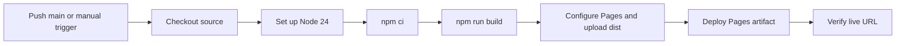

# 11. Builds and deployment

[Previous](10-debugging-and-testing.md) · [Learning path](../README.md) · [Next](12-typescript-and-next-steps.md)

**Goal:** understand exactly what moves from your working directory to the public web.

**Read alongside:** [vite.config.js](../../vite.config.js), [package.json](../../package.json), and [deploy.yml](../../.github/workflows/deploy.yml).

## Development, build, preview, deployment

| Command or operation | What it does | What it does not prove |
| --- | --- | --- |
| `npm run dev` | Starts Vite’s development server using source files | That production paths or hosting work |
| `npm run build` | Produces deployable static files in `dist/` | That user interactions pass tests |
| `npm run preview` | Serves the existing build locally | That the app is publicly deployed |
| Deployment | Publishes a selected build to a host | That every production route and asset is healthy |

A build is a transformation. The browser needs loadable JavaScript, CSS, and assets, not your dependency declarations or Vite’s Markdown import conventions.

In this Vite 7 project, the build follows the module graph from `index.html`, resolves dependencies, converts raw imports, bundles modules, removes eligible unused code, minifies output, emits assets, and rewrites HTML references. This release uses Rollup configuration under `build.rollupOptions`; see the [version-matched Vite build guide](https://github.com/vitejs/vite/blob/v7.3.6/docs/guide/build.md). Newer major versions can change the underlying bundler and configuration.

JavaScript still runs in the browser after building. A build is not a screenshot, and minification is not encryption. It is also not a test suite or a TypeScript type check.

## Inspect the artifact

```sh
npm run build
npm run preview -- --host 127.0.0.1
```

Open the preview URL printed in the terminal, commonly port 4173. This serves `dist/`, not the newest unbuilt source edits.

Typical output shape:

```text
dist/
├── index.html
└── assets/
    ├── index-<hash>.js
    ├── index-<hash>.css
    ├── scene-<hash>.js
    └── three-<hash>.js
```

Exact filenames and sizes can change. Content hashes let asset URLs change when their contents change, helping caches distinguish versions. The host’s cache policy still matters; a filename hash does not configure HTTP headers by itself.

The config manually separates Three.js into a chunk. The dynamic scene import is another chunk boundary. This can organize loading and caching, but it does not guarantee that a reader avoids downloading Three.js because the import starts immediately.

Build output may show raw and estimated gzip sizes. Gzip estimates do not mean `.gz` files were created or the host has compression enabled.

## Asset paths and the deployment base

Our `base: './'` makes generated references relative. This supports serving the app at a root URL or a project subpath such as `/personal-website/`.

Imported assets participate in the build graph. Future files in `public/` are copied unchanged into the output. Public-file names are not automatically fingerprinted like imported assets, and hand-written runtime URLs still need the correct base.

For a future public asset, use a base-aware expression rather than assuming the domain root:

```js
// Proposed example; this sound file does not exist yet.
const url = `${import.meta.env.BASE_URL}sounds/sea.ogg`;
```

A URL starting `/sounds/sea.ogg` points to the domain root, which can be wrong on a project subpath. On a production failure, inspect the actual requested URL and response in Network.

Our hash routes need no server rewrite rules: `#note-reading` never reaches the server. If we later adopt paths such as `/posts/reading`, the host must serve those documents or have an intentional fallback strategy. Changing routing is also a hosting change.

## What a static host provides

A static host maps requests to files. It may place them on a CDN, manage compression and caching, and provide a public HTTPS URL. It does not need our development server or `node_modules/` at runtime.

A typical hosting setup uses:

- Repository root as the project directory.
- Node 24 on the build machine.
- Locked dependency installation with development tools available.
- Build command `npm run build`.
- Output directory `dist`.

The browser downloads those files and runs the application locally. There is no database to provision for the current blog. Writing and rebuilding is how content is published.

## Read our GitHub Actions workflow

The current workflow has two jobs:



The YAML defines:

| Setting | Meaning here |
| --- | --- |
| `push.branches: [main]` | A push to main starts the workflow |
| `workflow_dispatch` | Allows a manual run once available on the repository |
| `contents: read` | Lets checkout read repository contents |
| `pages: write` | Lets the deployment publish a Pages artifact |
| `id-token: write` | Allows an identity token used by the deployment service |
| `concurrency.group: pages` | Groups deployment runs |
| `cancel-in-progress: true` | A newer run can supersede an in-progress run |
| `needs: build` | Deployment waits for a successful build job |
| `environment: github-pages` | Associates the deployment with its environment and URL |

`actions/setup-node` configures Node and caches npm’s download cache; `npm ci` still performs the installation. `upload-pages-artifact` packages the built files for `deploy-pages`. The official [custom Pages workflow guide](https://docs.github.com/en/pages/getting-started-with-github-pages/using-custom-workflows-with-github-pages) describes the artifact and deployment requirements.

This pipeline currently **builds and deploys**; it does not execute our learning tests, lint, or type-check. Continuous integration means automating validation of changes. Continuous deployment adds publication. Having a YAML file prepares automation; it does not mean it has run successfully.

## The actual deployment status

As of 2026-09-29, `Futtano/personal-website` is public and GitHub Pages uses **GitHub Actions** (`build_type: workflow`). The site address is [https://futtano.github.io/personal-website/](https://futtano.github.io/personal-website/). Deployment runs are listed in the [workflow history](https://github.com/Futtano/personal-website/actions/workflows/deploy.yml).

The earlier account-plan restriction applied when the repository was private. The owner made it public, resolving that constraint. `private: true` in `package.json` remains correct: it prevents npm publication and has no effect on Pages access.

### Why “Deploy from a branch” was incorrect here

Branch publishing from `main` at `/` served the source `index.html`. That document referenced `/src/main.js`, and its modules still depended on Vite transformations. A successful branch-publishing job therefore did not mean this application worked.

Our custom workflow runs `npm ci` and `npm run build`, then publishes only `dist/`. Set **Settings → Pages → Build and deployment → Source → GitHub Actions**. The existing workflow is sufficient; no second workflow or generated-files branch is needed. See [GitHub’s publishing-source documentation](https://docs.github.com/en/pages/getting-started-with-github-pages/configuring-a-publishing-source-for-your-github-pages-site).

Branch publishing is a valid alternative when a chosen branch/folder already contains deployable files. This project intentionally keeps build output out of Git, so its source branch is not that folder. Our learning `docs/` directory is also not the application build output.

The [deployment learning entry](../journal/2026-09-29-github-pages.md) records the correction and verification. Repository visibility, Pages publishing source, successful workflow execution, and a working live browser session are separate checks.

## The deployment procedure

1. Review content and source changes; ensure sample text is intentional.
2. Install the locked dependencies and run relevant checks.
3. Build, then test the output using preview, including direct article links.
4. Commit the intended source and lockfile. Avoid generated dependencies and secrets.
5. Push the intended commit to `main`, or manually run `Deploy website to GitHub Pages` on `main`. Keep the Pages source set to GitHub Actions.
6. Wait for the deployment job, not only the build job, to succeed.
7. Open the actual URL on another device. Check assets, article links, mobile reading, and graphics fallback.
8. Record the commit, deployment URL, result, and any differences from preview.

For a bad release, use the host’s redeployment mechanism for a known-good artifact, or revert the faulty source commit and redeploy. Avoid fixing production files manually: the next build will overwrite them.

## Domains, HTTPS, and environment variables

A custom domain is an address pointing to hosting infrastructure through DNS. It does not store the site. The hosting service must also recognize that domain and provision a TLS certificate for HTTPS. DNS propagation and certificate provisioning can take time; verify the provider’s current instructions when you actually configure one.

The current app has no secrets or environment configuration. If a future feature uses `VITE_*` variables, Vite exposes their values to client code during the build. They are not a place for private API keys. Changing them usually requires rebuilding. A backend is needed when an operation truly requires a secret unavailable to visitors.

## Try it

Build and open preview. Then edit one visible sentence without rebuilding. Compare the development and preview URLs. Rebuild and reload preview.

**Expected:** development updates first; preview changes only after a new build. No action in this experiment publishes anything.

## Checkpoint

What files do you deploy? Why is an npm-private package unrelated to a private website? Why can a successful build still lead to broken asset URLs? What would you verify before calling a deployment complete?
